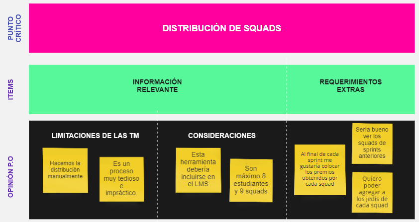
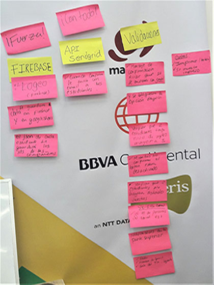
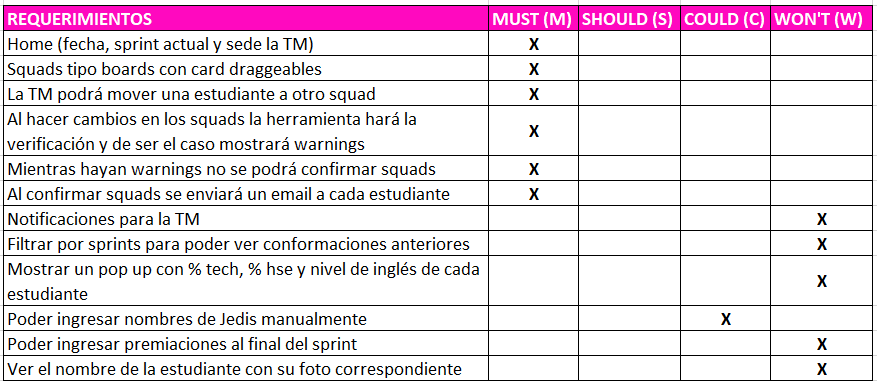

# Reto Hackathon: Distribución de Squads
----------
Herramienta de distribución de squads que facilita su gestión a las Training Managers.

## Elaborado para:

[Laboratoria](http://convocatoria.laboratoria.la/)

## Objetivo

- Generar una herramienta de distribución automática de squads por cada sprint que facilite a las Training Managers (TM) la gestión de equipos de estudiantes con diversos perfiles que se complementen.

## Problemática

Actualmente las Training Managers de Laboratoria no cuentan con una herramienta digital que les ayude a automatizar la distribución de estudiantes en squads, por lo que al realizar este proceso de forma manual agotan tiempo y otros recursos valiosos que podrían invertir en otras tareas. 

## Descubrimiento e Investigación

### El proceso de distribución en Squads

En Laboratoria se redistribuyen los squads en cada sprint, para que las estudiantes se conozcan y se potencien entre ellas.

Aprender en squads trae muchos beneficios. Sin embargo, generar estos squads cada sprint es una tarea tediosa para las Training Managers. 

_Variables que se tienen en cuenta:_

- % tech skills
- % soft skills
- Comunicación eficaz
- Manejo del tiempo
- Nivel de inglés
- Perfil
- Que no hayan estado en un mismo squad antes.

_Consideraciones_

Los squads son de 8 estudiantes, y su distribución debería incluir como mínimo:

- 1 estudiante con nota tech mayor a 70%
- 1 estudiante con comunicación eficaz mayor a 70%
- 1 estudiante con nivel de inglés 2  o 3
- 1 estudiante con nivel de inglés 0 o 1.

### User Research

#### Entrevista con Skateholders

Se realizaron dos entrevistas con la cliente (Product Owner) Alejandra Ramirez, quien es una de las Training Managers del Equipo de Laboratoria.

En una primera instancia obtuvimos sus insights sobre un primer diseño de la herramienta, las limitaciones que tienen actualmente y resaltó el hecho de ubicar esta herramienta de distribución y redistribución de squads en la plataforma LMS existente y que ellos manejan, puesto que sería más práctico y eficiente manejar un solo canal de gestión.

En una segunda instancia se validó un segundo diseño, se determinó el número de estudiantes por squads (8 alumnas en 9 squads) y se recogieron sugerencias y requerimientos adicionales de la TM, tales como:

- Esta herramienta debe permitir que los datos de los squads se guarden.
- En la sección de notificaciones podría recibir un mensaje que me alerte sobre los días que me quedan para subir las notas de las alumnas.
- Sería de ayuda poder filtrar por sprints.
- Sería genial si pudiera añadir las premiaciones que tuvo cada squad al final del sprint.
- Me gustaría agregar de manualmente los nombres de los jedis.
- Quisiera un botón para redistribuir squads.
- Estaría bien si visualizo los nombres de las alumnas con su foto correspondiente.

## Síntesis y Definición

- ### Affinity mapping

    Se agruparon los insights de la cliente en tres ítems claves:

    - Información relevante
    - Requerimientos Extras

    

- ### Definición y síntesis del proceso

El equipo de desarrollo mediante dinámicas con post its resumió el proceso de abordaje del problema y las herramientas a usar para su resolución.

## MVP
--------

### MoSCoW : Técnica de priorización de requerimientos

Se definió con todo el equipo de trabajo cada requerimiento en una escala de prioridad alta, media y baja:

### Feature List

De lo anterior se establecieron las características prioritarias de la herramienta:

- El home incluirá: fecha, sprint actual y la sede de la TM
- Los Squads se presentarán tipo boards con cards draggeables
- La TM podrá mover una estudiante a otro squad
- Al hacer cambios en los squads la herramienta hará la verificación y de ser el caso mostrará warnings
- Mientras hayan warnings no se podrán confirmar los squads
- La TM podrá ingresar los nombres de Jedis por cada squad
- Al confirmar la TM los squads se enviará un email a cada estudiante.

## Prototyping / Testing

Día 1 

Se elaboraron dos diseños a baja fidelidad (paper prototyping) de la herramienta, los cuales fueron consultados y sometidos a testing con la cliente (Product Owner).

Día 2

Se realizó el testing del diseño de la herramienta en html/css con la cliente, el feedback recogido fue: incluir la imagen de perfil de la TM, realzar los colores de la marca, que los squads se desplieguen con un scroll vertical, usar la tipografía de Laboratoria y que se incluyan las premiaciones en el prototipo del producto. 

[Paper prototyping & testing](https://photos.app.goo.gl/VOtcEailzeulYSj23)

## Conclusiones

La herramienta cumple con los feature lists priorizados y, adicionalmente se logró implementar:

- La vista de impresión y exportación a excel de los squads conformados.

## Elaborado por

### Equipo de Desarrollo

- [Carla Centeno](https://github.com/carlacentenor)
- [Nefeli Joñoruco](https://github.com/Nefelijm)
- [Patricia Urco](https://github.com/Patty8909)

### UX Designers

- [Darcy Cervera](https://github.com/darcycervh)
- [Yasmin Mattos](https://github.com/YasminMattos)

